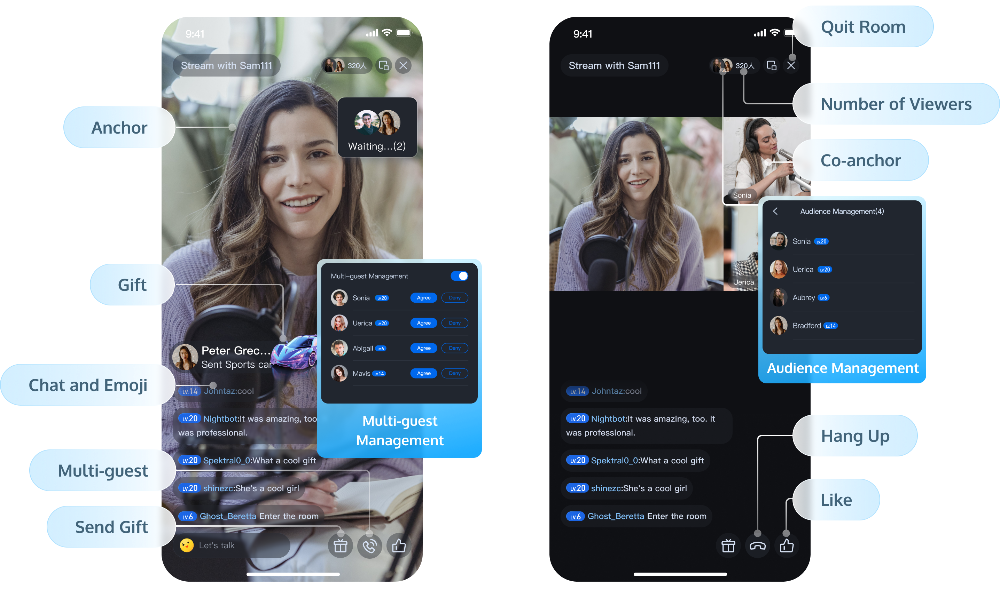

_简体中文 | [English](README.md)_

# 腾讯云 · 在线直播解决方案

TUILiveKit是一款适用于社交娱乐、购物、健身等互动直播场景的产品，通过集成该产品，仅需三步，30分钟内就可以为您的App添加互动连麦、送礼、房间管理等功能。

## 产品特性

  

- **完善的 UI 交互**：我们提供含 UI 的开源组件 TUILiveKit，可以节省您 90% 开发时间，您只需要花费30分钟就可以拥有一款类似抖音的在线直播应用。
- **多平台互联互通**：我们支持Android、iOS平台，您可以使用不同平台的 TUILiveKit 组件支持在线直播业务，未来我们还计划支持 Flutter、MacOS、Windows等平台。
- **互动弹幕**：我们支持自定义文本，自定义表情，房间信息提醒等多种互动信息展示。
- **互动礼物**：我们支持自定义礼物动画展示，费用自定义结算等功能。

## 开始使用

这里以 含 UI 的集成（即TUILiveKit）为例，这也是我们推荐的集成方式，关键步骤如下：

- **Step1**：[开通服务](https://cloud.tencent.com/document/product/647/105439)，针对开发者这里有详细的[组件介绍](https://cloud.tencent.com/document/product/647/105438) 
- **Step2**：接入 TUILiveKit 到您的项目中，各平台详细的接入流程：[iOS](https://cloud.tencent.com/document/product/647/105441)、 [Android ](https://cloud.tencent.com/document/product/647/105442)
- **Step3**：开启您的第一个在线直播体验

## 快速访问

- 如果你遇到了困难，可以先参阅“常见问题” [iOS](https://cloud.tencent.com/document/product/647/105457)，[Android](https://cloud.tencent.com/document/product/647/105458)，这里整理开发者最常出现的问题，覆盖各个平台，希望可以帮助您快速解决问题
- 如果您想了解我们最新的一些产品特性，可以查看更新日志 [iOS](https://cloud.tencent.com/document/product/647/105454)，[Android](https://cloud.tencent.com/document/product/647/105455)。这里有 TUILiveKit 最新的功能特性，以及历史版本功能迭代
- 完整的API文档见客户端API： [iOS](https://cloud.tencent.com/document/product/647/105450)，[Android](https://cloud.tencent.com/document/product/647/105451)。
- 如果你想了解更多腾讯云音视频团队维护的项目，可以查看我们的 [产品官网](https://cloud.tencent.com/product/rtcube)、[Github Organizations](https://github.com/LiteAVSDK) 等。

## 交流&反馈

如果您在使用过程中有遇到什么问题，欢迎提交 [**issue**](https://github.com/tencentyun/TUILiveRoom/issues)，，欢迎您加入我们的开发者QQ群进行技术交流和反馈问题，QQ群 ID：605115878.
