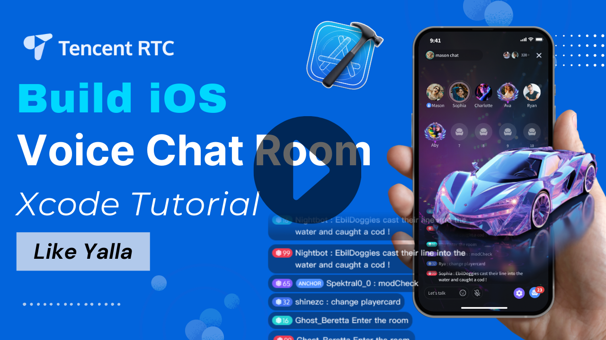

_[简体中文](README-zh_CN.md) | English_

# Tencent Cloud · Online Live Streaming Solution

TUILiveKit is a product suitable for interactive live streaming scenarios such as social entertainment, shopping, fitness, etc. By integrating this product, you can add features like interactive voice and video calls, gifting, room management, etc., to your App in just three steps within 30 minutes.

## Product Features

  

- **Comprehensive UI Interaction**：We provide an open-source component TUILiveKit with UI, which can save you 90% of development time. You only need to spend 30 minutes to have an online live streaming app similar to TikTok.
- **Multi-platform Interconnection**：We support Android and iOS platforms. You can use TUILiveKit components from different platforms to support online live streaming services. In the future, we also plan to support Flutter, MacOS, Windows, and other platforms.
- **Interactive Barrage**：We support custom text, custom emoticons, room information reminders, and other interactive message displays.
- **Interactive Gifts**：We support custom gift animation display, custom settlement of fees, and other functions.

## Before getting started

This section shows you the prerequisites you need for building voice chat room.

## Getting Started

Here, we take the UI-included integration TUILiveKit as an example, which is also our recommended method of integration. The key steps are as follows:：

- **Step1**：Integrate TUILiveKit into Your Project: Detailed Integration Process for Each Platform：[iOS](https://trtc.io/document/60036)、 [Android ](https://trtc.io/document/60037)
- **Step2**：Start Your First Online Live Streaming Experience

## Quick link

- If You Encounter Difficulties, You Can First Refer To'FAQs' [iOS](https://trtc.io/document/60048)，[Android](https://trtc.io/document/60043)，Here We Have Compiled the Most Common Issues Encountered by Developers, Covering Various Platforms. We Hope This Will Help You Solve Problems Quickly.
- To Learn About Our Latest Product Features, Please Check the Update Log [iOS](https://trtc.io/document/60047)，[Android](https://trtc.io/document/60042)。Here You Will Find the Latest Functional Features of TUILiveKit, as Well as the Iteration History of Past Versions
- Complete API Documentation Available in Client-side API： [iOS](https://trtc.io/document/60046)，[Android](https://trtc.io/document/60041)。
- If you want to learn more about the projects maintained by Tencent Cloud  Media Services Team, you can check our [Product Official Website](https://trtc.io/), [Github Organizations](https://github.com/LiteAVSDK) etc.

## Have any questions?
- Welcome to submit [**issue**](https://github.com/tencentyun/TUILiveRoom/issues),  
- Welcome to join our Telegram Group to communicate with our professional engineers! We are more than happy to hear from you，Click to join: https://t.me/+EPk6TMZEZMM5OGY1
Or scan the QR code 

